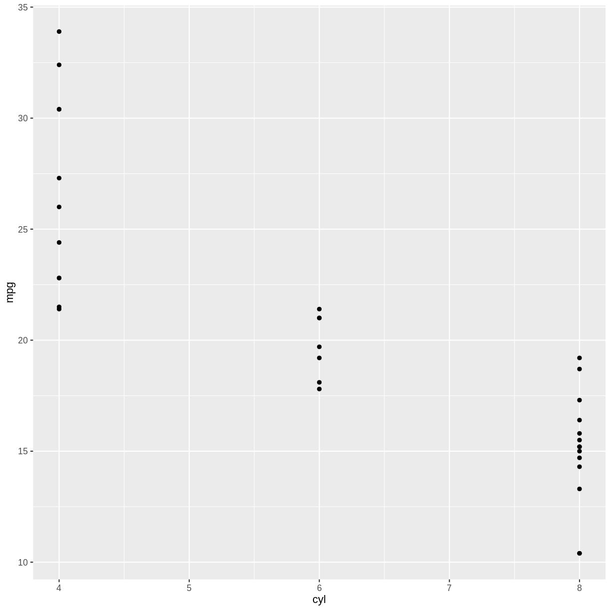

---
# Please do not edit this file directly; it is auto generated.
# Instead, please edit 02-distribution.md in _episodes_rmd/
title: "Distributions"
teaching: 42
exercises: 47
questions: 
- "FIXME"

objectives:
- "FIXME"

keypoints:
- "FIXME"
source: Rmd
---

We have some data on the mass of penguins. We expect some penguins to weigh 
more than others. Perhaps it is a smaller kind of penguin. Perhaps it is a 
female penguin, and they are smaller than male penguins. And maybe some penguins
are fatter than other penguins.

Ranking penguins from light to heavy, 
how many are there, or, what is the distribution of their weight?

## Histograms

### What are they?

Histograms takes all the weights of the penguins, divides them into intervals, 
or bins, of weight, eg one bin with 3300 to 3400 grams, and the next bin from 
3400 to 3500 grams. Then we count how many penguins are in a specific bin. 
And plot it. It might look like this:

~~~
library(tidyverse)
mtcars %>% ggplot(aes(cyl,mpg)) + 
  geom_point()
~~~
{: .language-r}

### Python test

~~~
library(reticulate)
knitr::knit_engines$set(python = reticulate::eng_python)  
knitr_fig_path("02-")
~~~
{: .language-r}

Creating histogram

~~~
import matplotlib.pyplot as plt
import numpy as np

np.random.seed(42)
x = np.random.normal(size=1000)

plt.hist(x, density=True, bins=30)  # density=False would make counts
~~~
{: .language-python}

~~~
(array([0.00422893, 0.        , 0.01268678, 0.01268678, 0.02537356,
       0.05497605, 0.0803496 , 0.15647028, 0.16915706, 0.23259096,
       0.31716949, 0.4144348 , 0.32139842, 0.3975191 , 0.43135051,
       0.36368768, 0.35522983, 0.23681989, 0.19030169, 0.13109672,
       0.11840994, 0.09726531, 0.05074712, 0.01268678, 0.02960249,
       0.00422893, 0.00422893, 0.        , 0.        , 0.00422893]), array([-3.24126734, -3.00480071, -2.76833408, -2.53186746, -2.29540083,
       -2.0589342 , -1.82246757, -1.58600095, -1.34953432, -1.11306769,
       -0.87660106, -0.64013444, -0.40366781, -0.16720118,  0.06926545,
        0.30573208,  0.5421987 ,  0.77866533,  1.01513196,  1.25159859,
        1.48806521,  1.72453184,  1.96099847,  2.1974651 ,  2.43393172,
        2.67039835,  2.90686498,  3.14333161,  3.37979824,  3.61626486,
        3.85273149]), <BarContainer object of 30 artists>)
~~~
{: .output}

~~~
plt.ylabel('Probability')
plt.xlabel('Data')
plt.show()
~~~
{: .language-python}

### What do we use them for?

We typically use histograms to visualise the distribution of a variable. Is it
normal, bimodal, uniform or skewed? It can quickly reveal mistakes in data or 
weird outliers.

We can also use histograms to compare different variables. But beware of comparing
too many, it can make the graphs difficult to read, and the aim of visualising 
is to make things easier to understand.

### how do we make them?

Bins can be determined in two ways, either by providing a number of bins:
*geom_histogram(bins = 30)* 
or by specifying the width of the bins:
*geom_histogram(binwidth = 500)*

### Interesting variations

#### more than one on same axis

Note that we do not map sex to color, but rather to fill. Color is the 
color of the outline of the individual bars, fill the inside of the 
bars.

#### Upside-down

Or mirrored histogram.

det skal vist gøres lidt mere læseligt...

#### Grid

#### margin

### Think about

The number of bins (or their width, they are equivalent) can lead to very
different conclusions. Try several sizes.

* Weird and complicated color schemes does not add insight. Avoid them.

* This is not a barplot! Histograms plot the distribution of a single variable.

* Avoid comparing more than two, maybe three groups in the same histogram. 

* Do not use unequal bin widths. 

## Boxplots

### What are they?

A summary of one numeric variable. It has several elements.

* The line dividing the box represents the median of the data.
* The ends of the box represents the upper and lower quartiles, (Q3 and Q1 
respectively). 50% of the observations are in this box. This is also called the 
interquartile range (IQR).
* The line at the top of the box, shows Q3 + 1.5 * IQR. This is interpreted as the
values above Q3 that are not outliers.
* The line at the bottom of the box, shows Q1 + 1.5 * IQR. This is interpreted as
the values below Q1 that are not outliers.
* Dots at each end of the lines shows potential outliers.

### What do we use them for?

A boxplot summarises several important numbers related to the distribution of 
data. A rule of thumb (but not necessarily a good one), is that if two sets of 
data do not have overlapping boxes, they come for different distributions, and
are therefore different.
Typically we show more than one boxplot, but a collection of boxplots.

### how do we make them?

Typically we want to compare the weight of different groups of penguins:

Gentoo penguins are generally heavier than Chinstrap and Adelie penguins. But
some Chinstraps and Adelies are as heavy as Gentoos. Remember that this overlap
does not mean that we can not conclude that Gentoos are not larger that the two
other species of penguins.

### Interesting variations

The box can obscure patterns in the distribution. It is often a good idea to
add the actual datapoints to the boxplots. We use geom_jitter rather than
geom_point. Points might overlap in a way that makes it impossible to see if a
point represents 1 or 50 penguins. geom_jitter adds small amounts of noise to 
the points.

### Think about

Boxplots might hide interesting features. 

## Density

### What are they?

### What do we use them for?

### how do we make them?

### Interesting variations

### Think about

## Ridgeline

### What are they?

### What do we use them for?

### how do we make them?

### Interesting variations

### Think about

## Violin

### What are they?

### What do we use them for?

### how do we make them?

### Interesting variations

### Think about


